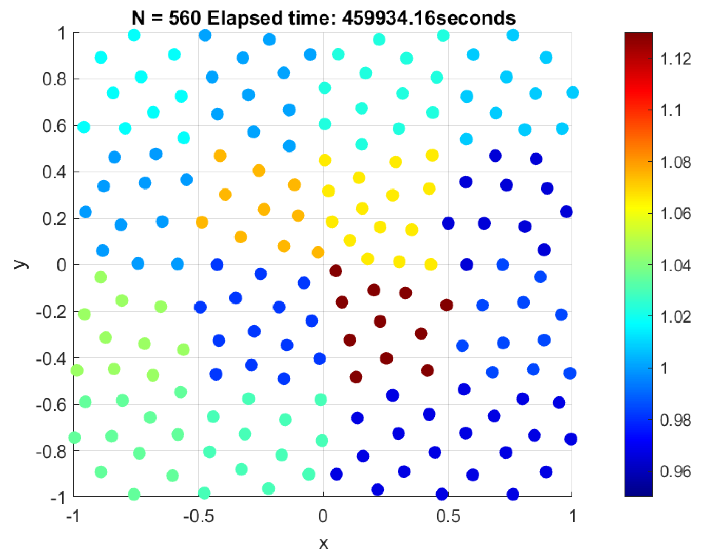

> [!NOTE] 
> For proper equation rendering, please view this documentation in day mode instead of night mode. 

This repository provides the MATLAB implementation of the MCMC algorithm presented in the following paper: 

[Takashi Furuya](https://kendb.doshisha.ac.jp/profile/en.77bfc1f47b9eacdc.html), [Pu-Zhao Kow](https://puzhaokow1993.github.io/homepage/) and [Jenn-Nan Wang](http://www.math.ntu.edu.tw/~jnwang/), *Consistency of the Bayes method for the inverse scattering problem with randomly truncated Gaussian priors*, May 14, 2025, [preprint](https://www.math.ntu.edu.tw/~jnwang/pub/resources/random_truncation(0515).pdf)

We will not going to explain all notations here, please refer to our paper for more details. 

In this work, we apply the Bayes approach to study the inverse medium scattering problem. Let  and  be a compactly supported function in  with \subset%20D), where  is an open bounded smooth domain, and having suitable regularity. Let  satisfy 

  
 in 

and the scattered field  satisfies the Sommerfeld radiation condition 

  
=0).  

Assume that  is the plane incident field, i.e. =e^{\mathbf{i}k\theta'\cdot\theta}) for all . Then the scattered field  posses the asymptotic behavior 

  
=\frac{e^{\mathbf{i}k|x|}}{|x|}u_n^\infty(\theta',\theta)+o(r^{-1}))   as   ,  

where . The inverse scattering problem is to determine the medium perturbation  from the knowledge of the scattering amplitude ) for all . We adopt a Bayesian approach to this problem, providing not only rigorous theoretical justifications but also supporting numerical simulations.

# Algorithm # 

**Require:** an initial guess }) and a resolution parameter })

1. Set ={\rm%20accept})
2. Creating an empty sequence )_{\tau=1}^{\infty})
3. **for  do**
4. $~~~~$ Generate =\sum_{r,s\in\mathbb{Z}}F_{rs}\chi_{(0,1)\times(0,1)}(2^{J_0}x-r,2^{J_0}y-s)) with randomly chosen )
5. $~~~~$ Propose }=\sqrt{(1+\beta^2)}F^{(\tau)}+\beta%20F)
6. $~~~~$ **if ={\rm%20accept}) then**
7. $~~~~~~~~$ }(F^{(\tau)})), where }) is the log-likelihood function given in equation (2.8) of our paper.
8. $~~~~$ **end if**
9. $~~~~$ Compute }(F^{(\tau+1)})-\ell_{\rm%20current})
10. $~~~~$ Generate a uniform random number ![u\in[0,1]](https://latex.codecogs.com/png.image?\dpi{110}u\in[0,1])
11. $~~~~$ **if <u_*) then**
12. $~~~~~~~~$ Set ={\rm%20accept})
13. $~~~~$ **else**
14. $~~~~~~~~$ Set }=F^{(\tau)}) and ={\rm%20reject})
15. $~~~~$ **end if**
16. **end for**

**Return:** })_{\tau=1}^{\infty}) by removing all entries }) each corresponds to ={\rm%20reject})

> [!IMPORTANT] 
> The if condition <u_*) and the log-likelihood function }) cannot be replaced by ) and the likelihood function, respectively, due to limited floating point, despite they are mathematical equivalent. 

> [!TIP] 
> The numerical computation can be significantly speeded up by employing the parallel computing, using [MATLAB Parallel Computing Toolbox](https://www.mathworks.com/products/parallel-computing.html). Using `parfor` rather than `for` also speed up the computations. 

# Results # 

The perturbation }) is approximated by })) for a sufficiently large integer , where }) denotes the 'burn-in' sample mean, defined as 

  
}=\frac{1}{\lfloor%20T/2\rfloor}\sum_{\tau=\lfloor%20T/2\rfloor+1}^{T}F^{(\tau)})

The calculations were performed on an 8-core workstation, allowing a parallel solution of 8 equations simultaneously. The PDE (used to compute the log-likelihood function) was discretized using the finite element method with a mesh size of at most 0.3. 

## Result 1 ##

In order to reconstruct 

  
![n^{(\rm%20true)}=1+\frac{1}{10}\chi_{[-1/2,1/2]\times[-1/2,1/2]}](https://latex.codecogs.com/png.image?\dpi{110}n^{(\rm%20true)}=1+\frac{1}{10}\chi_{[-1/2,1/2]\times[-1/2,1/2]}), 

we choose the wave number , noise level , initial guess }\equiv0), sample size , learning rate , and resolution parameter . A total of 30000 iterations were carried out, requiring approximately a duration of 18 days and 3 hours (specifically, 1568082 seconds) to compute. 

The progression of the log-likelihood  over iterations is shown in figure below. 

 

The plot of 'burn-in' sample mean }) and the ground truth }) on FEM mesh is shown in figure below. 

  

## Result 2 ##

In order to reconstruct 

  
}=1+\frac{1}{10}\chi_{x<1/2,y<1/2,x+y>-1/4}), 

we choose the wave number , noise level , initial guess }\equiv0), sample size , learning rate , and resolution parameter . Based on some experiences in [Result 1](#result-1), this time only a total of 10000 iterations were carried out, requiring approximately a duration of 5 days and 8 hours (specifically, 459934 seconds) to compute. 

The progression of the log-likelihood  over iterations is shown in figure below. 

 

The plot of 'burn-in' sample mean }) and the ground truth }) on FEM mesh is shown in figure below. 

  

[comment]: <> (https://docs.github.com/en/get-started/writing-on-github/getting-started-with-writing-and-formatting-on-github/basic-writing-and-formatting-syntax)
